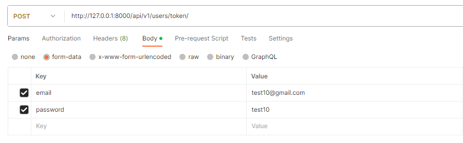
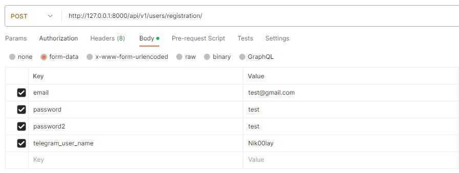
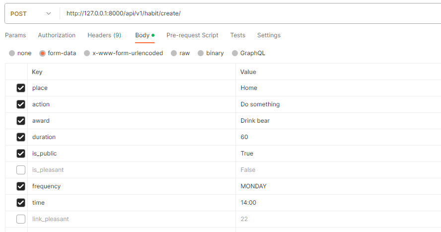

## DOCKER COMPOSE

## Prepare 
* prepare /app/.env file (examples in /app/.env_sample)
## Start service
* run command docker-compose up
## Work with API (habits)
* http://127.0.0.1:8000/api/v1/habits/ - show all habits that user has access
* http://127.0.0.1:8000/api/v1/habit/<int:pk>/ - show user's habit detail information
* http://127.0.0.1:8000/api/v1/habit/create/ - create habit
* http://127.0.0.1:8000/api/v1/habit/update/<int:pk>/ - update habit
* http://127.0.0.1:8000/api/v1/habit/delete/<int:pk>/ - delete habit
* http://127.0.0.1:8000/api/v1/share_habits/ - show all public habits
## Work with API (users)
* http://127.0.0.1:8000/api/v1/users/show/ - show all users
* http://127.0.0.1:8000/api/v1/users/show/<int:pk>/ - show user's detail information
* http://127.0.0.1:8000/api/v1/users/update/<int:pk>/ - update user information
* http://127.0.0.1:8000/api/v1/users/delete/<int:pk>/ - delete user information
* http://127.0.0.1:8000/api/v1/users/registration/ - register user
* http://127.0.0.1:8000/api/v1/users/token/ - get token for user
* http://127.0.0.1:8000/api/v1/users/token/refresh/ - refresh user token
## API Documentation (v1)
* http://127.0.0.1:8000/redoc/
## Examples work with interface
### User authorization

### User registration

### Habit creation

### Description Requests format
* place - place of user habit
* action - what to do
* award - what user get for his not pleasant habit
* duration - duration of habit (less than 121 seconds)
* is_public - public or private habit
* is_pleasant - flag for pleasant or not pleasant (usual) habit
* frequency - daily habit or you can check day of week (MONDAY-SUNDAY)
* time - when execute user habit
* link_pleasant - usual (not pleasant) habit can have pleasant habit(in this case no award)

## Additional
* Author: Avramenko Nikolay
* Date of release: 2023/09/01